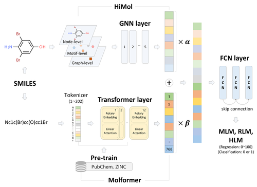

# HiMolformer
Integrating GNN and Transformer representations for predicting liver microsome stability with SMILES



## Main packages
- **Python**: `3.9.0`
- **RDKit**: `2022.03.2`
- **PyTorch**: `2.1.0+cu118`

## Train & Inference
To train and perform inference with the model, use the following command:
```bash
python main.py
```
By configuring the hyperparameters in **'config.yaml'**, you can facilitate both training and inference processes.

## :construction: This repository is currently in progress. :construction:
